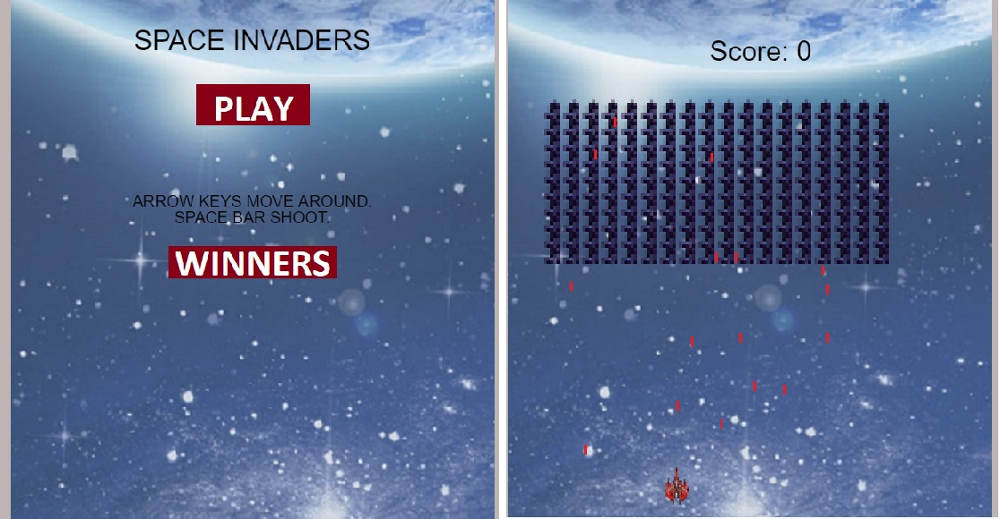

# Shooter-game

Shooter game built with Phaser and javascript, a player fights with a lot of enemies to avoid an invasion.


GitHub [Live Demo Link](https://rawcdn.githack.com/cgcarlosg/shooterGameJs/91f27023ff9642fd933842e50f3a1dd0d4ffc247/dist/index.html)

Netlify [Live Demo Link](https://relaxed-hypatia-4152fa.netlify.app/)

## Screenshots of the app.




## How to play

Follow these instructions:

- In the first page click on "Play".

- Use Arrow keys to move to both sides: Left and Right

- Use Space bar button to shoot lasers.

- Destroy and collect as many scores as possible.

- When the game is over put your name and submit it.

### Built With

* Phaser
* JavaScript
* WebPack
* HTML
* CSS
* Jest

<hr>

## Video Presentation


Video [Loom video](https://www.loom.com/share/a1c1477a5db940e3b6bc4d97f3ad3f5b)


<br>
<br>


## Getting Started

To get a local copy up and running follow these simple steps.

### Prerequisites

- Make sure your machine has `node` and `npm` packages installed.

### Installation
 
- Clone the repo
```sh
git clone https://github.com/cgcarlosg/shooterGameJs
```
- Open with your favorite text editor.
- run `npm install` to install all dependencies required for the app.
- with live server extension installed, open the `index.html` file in the `dist` folder with the live server, if not 
- Enjoy the game!

### Game Design

-TARGET PLATFORM:  Browser game

-UI / PLAYER CONTROLS: left and right arrow keys to moves in that direction and the spacebar to shoot.

- GAME MECHANICS: Enemies moving left to right and down. If the player is hit by a laser the game restart. The player wins if he kills all the enemies. The player moves only from left to right.

- ASSETS: Sprites for background, player and enemies.
### Tests
- Run `npm run test` to see all tests.

## Roadmap

See the [open issues](https://github.com/cgcarlosg/shooterGameJs/issues) for proposed features.

## Contributing

Contributions are what make the open source community such an amazing place to be learn, inspire, and create. Any contributions you make are **greatly appreciated**.

1. Fork the Project
2. Create your Feature Branch (`git checkout -b feature/feature`)
3. Commit your Changes (`git commit -m 'Add some stuff'`)
4. Push to the Branch (`git push`)
5. Open a Pull Request from your branch


## Contact

👤 **Carlos Gutierrez**

- GitHub:  [@cgcarlosg](https://github.com/cgcarlosg)
- Twitter: [@cgcarlosg1](https://twitter.com/cgcarlosg1)
- LinkedIn: [@carlosalbeniogutierrez](www.linkedin.com/in/carlosalbeniogutierrez)


## Show your support

Give a ⭐️ if you like this project!

## Acknowledgements
- Phaser3. A great tool to enjoy programming
