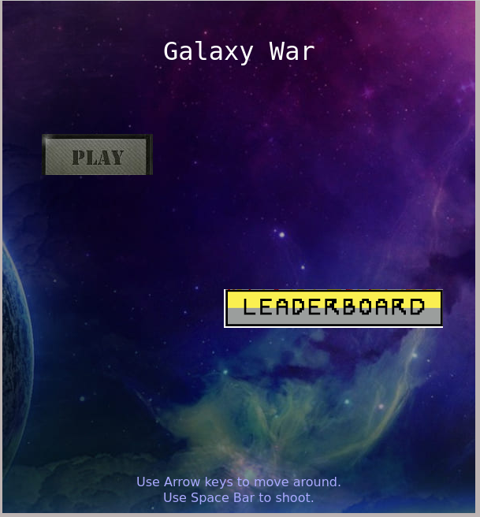
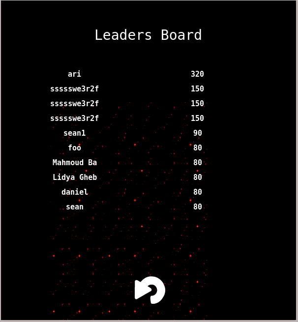

# Shooter-game

Shooter game built with Phaser and javascript, a player fights until death for his/her galaxy with 3 lives and limitted hidden shield.


GitHub [Live Demo Link](https://arikarim.github.io/Shooter-game/)

Heroku [Live Demo Link](https://shooterr-game.herokuapp.com/)

## Screenshots of the app.





## How to play

Follow these instructions:-

- In the main page click on (Play) button.

- Use Arrow keys to move (Left, Right, Up and Down)

- Use Space bar button to shoot lasers.

- you have 3 lives so fight carefully.

- Destroy and collect as many scores as possible.

- When the game is over put your name and submit it.

- if you want you can play again.


### Built With

* Phaser
* JavaScript
* WebPack
* HTML
* CSS
* Jest

<hr>

## Game Design

 <br>
This is the plater ship, and he has 3 lives to kill as many enemy ships as possible.
<br>
<br>

 <br>
This are the enemy ships trying to destroy you with lasers

<br>
<br>

 &nbsp;&nbsp; Player laser used to destroy enemy ships.

<br>
<br>

 &nbsp;&nbsp; Enemy laser used to destroy main character's ship.

<br>
<br>

<!-- GETTING STARTED -->
## Getting Started

To get a local copy up and running follow these simple steps.

### Prerequisites

- Make sure your machine has `node` and `npm` packages installed.

### Installation
 
- Clone the repo
```sh
git clone https://github.com/arikarim/Shooter-game
```
- Open with your favorite text editor.
- run `npm install` to install all dependencies required for the app.
- If you have a live server extension installed, open the `index.html` file in the `dist` folder with the live server, if not install a live server extension and do as above.
- Play the game and enjoy!!!!


### Tests
- Run `npm run test` to see all available tests associated with this project.

<!-- ROADMAP -->
## Roadmap

See the [open issues](https://github.com/arikarim/Shooter-game/issues) for a list of proposed features (and known issues).


<!-- CONTRIBUTING -->
## Contributing

Contributions are what make the open source community such an amazing place to be learn, inspire, and create. Any contributions you make are **greatly appreciated**.

1. Fork the Project
2. Create your Feature Branch (`git checkout -b feature/AmazingFeature`)
3. Commit your Changes (`git commit -m 'Add some AmazingFeature'`)
4. Push to the Branch (`git push origin feature/AmazingFeature`)
5. Open a Pull Request from your branch


<!-- CONTACT -->
## Contact

👤 **Ari Karim**

- Github: [Arikarim](https://github.com/arikarim)
- Linkedin: [Arikarim](https://www.linkedin.com/in/ari-karim/)


<!-- ACKNOWLEDGEMENTS -->
## Show your support

Give a ⭐️ if you like this project!

## Acknowledgements
- Special thanks to [Microverse](https://www.microverse.org/) for this opportunity to learn something new on the fly and apply it in a project.
